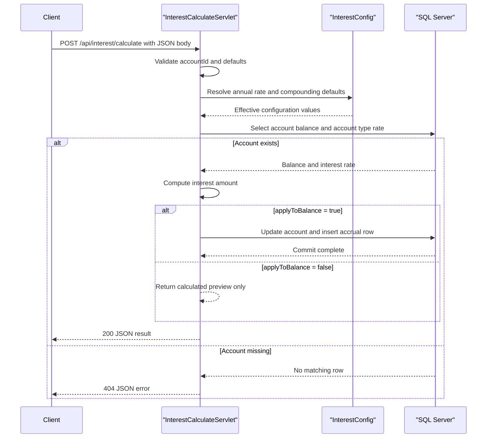

# API & Service Communication Contracts

This application exposes a very small servlet-based API surface: two JSON POST endpoints for interest operations and one health endpoint. All communication is synchronous, with direct JDBC calls to SQL Server and no asynchronous messaging or downstream service mesh.

## Service Catalog

| Service | Port | Category | Purpose |
|---|---:|---|---|
| ZavaInterestCalculator | 8080 | Business | Calculates and accrues account interest using SQL Server-backed account data |

## API Endpoints Inventory

| Service | Method | Path | Request Type | Response Type |
|---|---|---|---|---|
| ZavaInterestCalculator | GET | `/health` | None | HTML status page, 200 |
| ZavaInterestCalculator | POST | `/api/interest/calculate` | Raw JSON body with `accountId`, `interestType`, `days`, `annualRate`, `compoundsPerYear`, `termMonths`, `applyToBalance` | JSON object with balances, interest amount, and status codes 200, 400, 404, 500 |
| ZavaInterestCalculator | POST | `/api/interest/accrue-all` | Raw JSON body with `interestType`, `days`, `compoundsPerYear`, `termMonths` | JSON object with accrued account count, total interest, and status codes 200 or 500 |
| ZavaInterestCalculator | Startup hook | `/internal/bootstrap` | None at runtime; servlet `init()` creates schema objects on startup | Not intended as a public contract |

## Management & Observability Endpoints

| Service | Endpoint | Custom Metrics |
|---|---|---|
| ZavaInterestCalculator | `/health` | None detected |

## DTOs & Contracts

The API contract is expressed through ad hoc `org.json.JSONObject` payloads instead of named DTO classes. Request and response bodies are mutable JSON objects assembled inside `InterestCalculateServlet` and `InterestAccrueAllServlet`, so there are no immutable request records, generated client contracts, OpenAPI specifications, protobuf schemas, or GraphQL schemas. Serialization is handled manually through the `org.json` library and servlet response writers.

## Communication Patterns

Client communication is synchronous HTTP over servlet endpoints. Inside the service, both business endpoints synchronously open JDBC connections and execute SQL queries or updates against SQL Server. No asynchronous messaging, retry policy, circuit breaker, timeout policy, client-side load balancing, or service discovery mechanism was identified. Startup availability depends on the database being reachable because `InterestBootstrapServlet` performs schema initialization during startup. No authentication, authorization, or TLS enforcement is implemented at the API layer; the endpoints are publicly reachable within whatever network exposes Tomcat.

## Service Technology Matrix

| Service | Web | Data Access | Discovery | Gateway | Actuator | Cache | Metrics |
|---|---|---|---|---|---|---|---|
| ZavaInterestCalculator | Servlet + JSP | JDBC | none | none | custom health servlet | none | none |

## Service Communication Sequence

