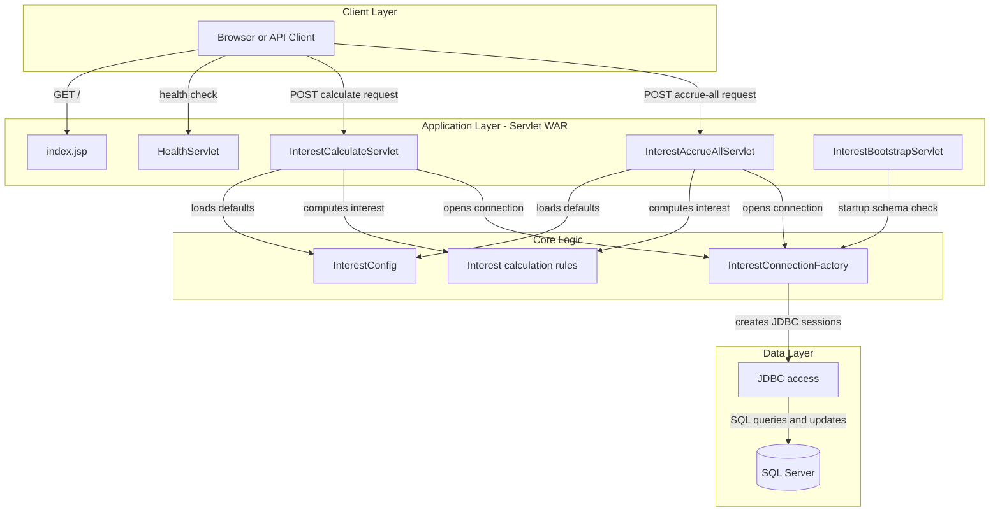
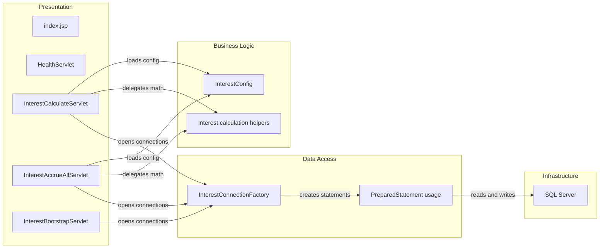

# Architecture Diagram

This repository contains a single deployable banking web application that exposes servlet endpoints for interest calculation and accrual. It is packaged as a WAR, runs on Tomcat, and talks directly to SQL Server through JDBC.

## Application Architecture

### Technology Stack Summary

| Layer | Technology | Version | Purpose |
|---|---|---:|---|
| Presentation | JSP + HttpServlet | Servlet 3.1 | Serves landing page, health page, and JSON endpoints |
| Business Logic | Custom Java classes | Java 8 | Computes simple, compound, and amortized interest |
| Data Access | JDBC + SQL Server driver | mssql-jdbc 12.6.3.jre8 | Reads account balances and writes accrual records |
| Runtime | Tomcat container | 9-jdk8 | Hosts the WAR package |
| Build | Gradle | build image 7.6 | Produces the deployable WAR |

### Data Storage & External Services

The application depends on a single SQL Server database. It reads account and account-type data from shared banking tables and writes accrual history into an `InterestAccruals` table that is created during servlet startup when it does not already exist. No caches, queues, or third-party APIs were identified.

### Key Architectural Decisions

- Uses deployment-descriptor registration in `web.xml` instead of annotation-driven endpoint discovery.
- Keeps business logic inside servlets with helper methods rather than a separate service or repository layer.
- Initializes schema state at application startup through `InterestBootstrapServlet`.

## Component Relationships

### Component Inventory

| Component | Layer | Type | Responsibility |
|---|---|---|---|
| `index.jsp` | Presentation | JSP page | Static landing page for the application |
| `HealthServlet` | Presentation | Servlet | Returns a simple availability page |
| `InterestCalculateServlet` | Presentation | Servlet | Calculates interest for a single account and optionally applies it |
| `InterestAccrueAllServlet` | Presentation | Servlet | Accrues interest for all active accounts in one transaction |
| `InterestBootstrapServlet` | Presentation | Servlet | Creates the accrual table during startup |
| `InterestConfig` | Business Logic | Configuration helper | Resolves environment variables and default rates |
| `InterestConnectionFactory` | Data Access | Connection factory | Opens SQL Server JDBC connections |
| SQL Server | Infrastructure | Database | Stores account balances, account types, and accrual history |
