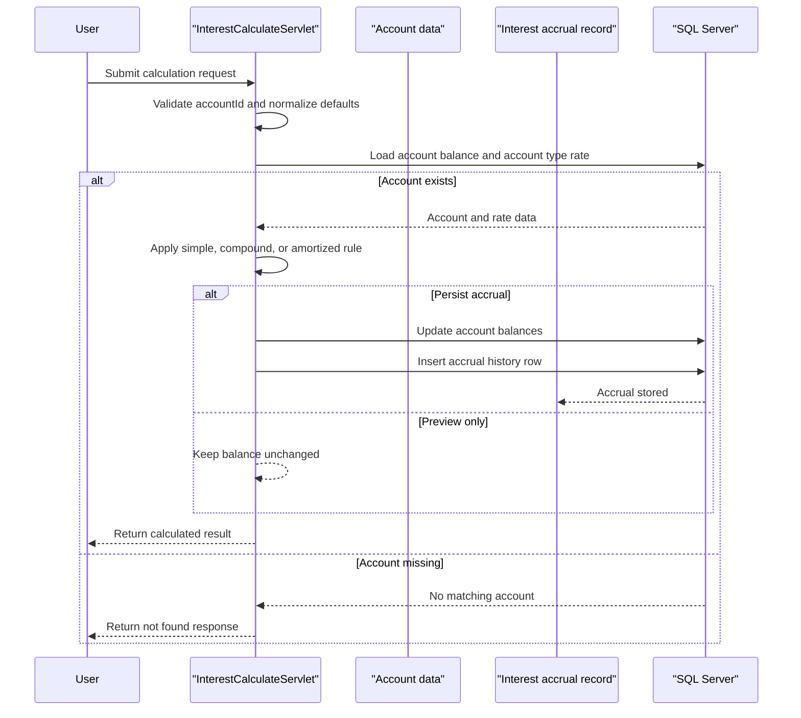

# Core Business Workflows

The application supports a narrow banking workflow: computing interest for one account or applying accrued interest across all active accounts. Its business logic centers on choosing the right rate, calculation method, and persistence behavior for each request.

## Domain Entities

| Entity | Service / Bounded Context | Description | Key Relationships |
|---|---|---|---|
| Account | Interest Calculation | Bank account whose balance is used as the principal for accruals | Linked to one account type and many interest accrual records |
| Account Type | Interest Calculation | Holds default interest rates used when a request does not provide one | Classifies many accounts |
| Interest Accrual | Interest Calculation | Historical record of a calculated accrual event | Belongs to one account |
| Interest Calculation Request | Interest Calculation | Incoming business request describing how interest should be computed | Drives either preview-only or persisted accrual behavior |

## Service-to-Domain Mapping

| Service | Domain Context | Owned Entities | External Dependencies |
|---|---|---|---|
| ZavaInterestCalculator | Interest Calculation | `InterestAccrual` | Shared SQL Server `Accounts` and `AccountTypes` tables |

## Primary Workflows

### Workflow 1: Calculate interest for a single account

A client submits `POST /api/interest/calculate` with an account identifier and optional calculation parameters. The servlet validates the request, loads the account balance and default interest rate, computes simple, compound, or amortized interest, and returns either a preview result or a persisted accrual depending on `applyToBalance`.

### Workflow 2: Accrue interest for all active accounts

A client submits `POST /api/interest/accrue-all` with optional batch parameters. The servlet selects all active accounts, computes interest for each row, updates balances, inserts one accrual record per account, and commits the transaction once the batch completes.

### Workflow 3: Bootstrap accrual storage at startup

During application startup, `InterestBootstrapServlet` ensures that the `InterestAccruals` table exists. This startup workflow prepares the persistence layer before any business request can be served.

## Cross-Service Data Flows

No cross-service API composition was detected. Business flows stay inside one deployable application and one SQL Server database. The only external dependency that affects business outcomes is the database itself: if SQL Server is unavailable, both single-account calculation and bulk accrual workflows fail with server errors or startup failure.

## Business Workflow Sequence

## Business Rules & Decision Logic

- `accountId` is required for single-account calculations; missing or non-positive values return a client error.
- `days`, `compoundsPerYear`, and `termMonths` fall back to safe defaults when the request provides non-positive values.
- The annual rate is chosen in priority order: explicit request value, account type rate, then configured default rate.
- Supported interest types are `simple`, `compound`, and `amortized`; unsupported values are rejected.
- Bulk accrual processes only accounts whose status is `Active`.
- Persistence is conditional for single-account calculations: `applyToBalance=true` updates balances and writes an accrual record; otherwise the workflow returns a non-persistent preview.
