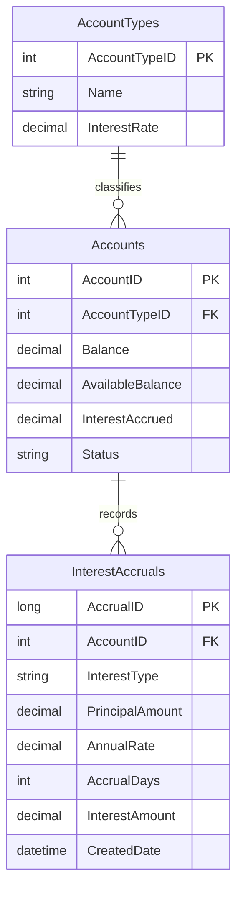

# Data Architecture & Persistence Layer

The application uses a single SQL Server database and accesses it through direct JDBC calls rather than an ORM. Persistence concerns are limited to reading shared account data and writing interest accrual history.

## Database Configuration

| Service/Module | DB Type | Profile | Driver | Connection | Migration Tool |
|---|---|---|---|---|---|
| ZavaInterestCalculator | SQL Server | Default runtime with environment-variable overrides | `com.microsoft.sqlserver:mssql-jdbc:12.6.3.jre8` | JDBC URL built from host, port, and database name in `InterestConfig` | None; `InterestBootstrapServlet` creates `InterestAccruals` on startup |

## Data Ownership per Service

| Service | Tables Owned | ORM Framework | Caching | Notes |
|---|---|---|---|---|
| ZavaInterestCalculator | `InterestAccruals` | None; direct JDBC | None | Also reads shared `Accounts` and `AccountTypes` tables owned outside this repo |

## Entity Model

## Key Repository Methods

| Service | Repository | Notable Methods | Purpose |
|---|---|---|---|
| ZavaInterestCalculator | `InterestCalculateServlet` | `loadAccount(...)`, `applyAccrual(...)` | Loads one account snapshot and optionally persists an accrual transaction |
| ZavaInterestCalculator | `InterestAccrueAllServlet` | `doPost(...)` | Scans active accounts, calculates accrued interest, updates balances, and inserts accrual rows |
| ZavaInterestCalculator | `InterestBootstrapServlet` | `init()` | Creates the `InterestAccruals` table if it does not already exist |

## Caching Strategy

No cache provider or cache-aside pattern was detected. Every business request reaches SQL Server directly, and configuration defaults are kept only in a static in-memory `Properties` object loaded from `interest.properties`.

## Data Ownership Boundaries

The repository represents a single application service talking to a shared SQL Server database. It owns the `InterestAccruals` history table that it bootstraps itself, but it depends on pre-existing `Accounts` and `AccountTypes` tables for source-of-truth account balances and default rates. There is no CQRS split, no event outbox, and no cross-service API composition; all read and write flows are synchronous SQL operations in the same database transaction scope.

### Data Classification & Sensitivity

| Entity | Sensitive Fields | Classification (PII/PHI/PCI/None) | Controls in Place |
|---|---|---|---|
| `Accounts` | `AccountID`, `Balance`, `AvailableBalance`, `InterestAccrued` | Confidential financial data | No encryption, masking, or field-level access controls were identified in code or config |
| `InterestAccruals` | `AccountID`, `PrincipalAmount`, `AnnualRate`, `InterestAmount` | Confidential financial data | No encryption, masking, or field-level access controls were identified |
| `AccountTypes` | Interest rate metadata | Internal | No explicit controls identified |
