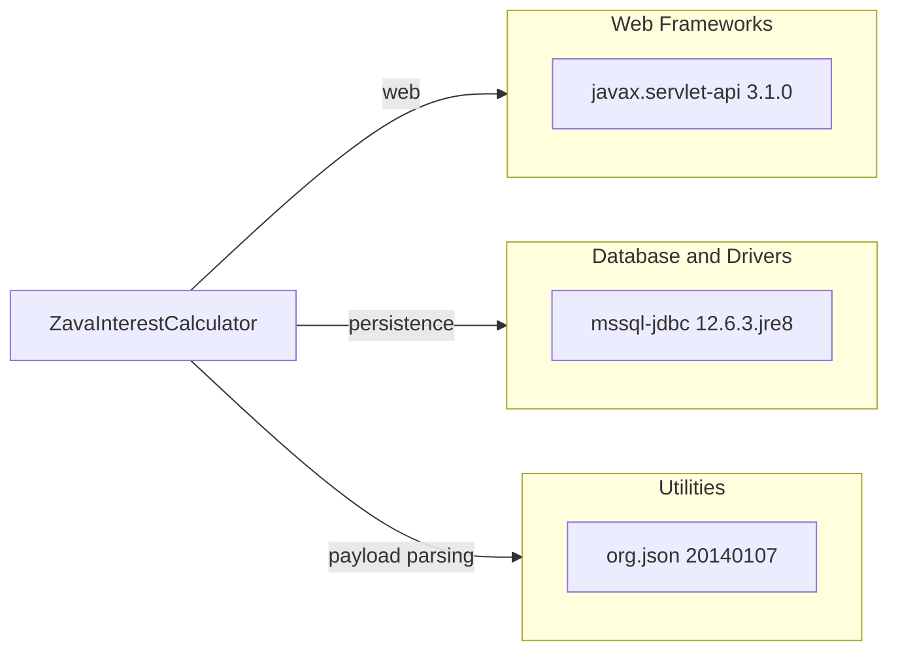

# Dependency Map

ZavaInterestCalculator declares 3 non-test dependencies in its Gradle build. The dependency set is small and centers on servlet hosting, SQL Server connectivity, and JSON payload handling.

## Dependencies

### Dependency Summary

| Category | Count | Key Libraries | Notes |
|---|---:|---|---|
| Web Frameworks | 1 | javax.servlet-api 3.1.0 | Compile-only servlet contract for WAR deployment |
| Database and Drivers | 1 | com.microsoft.sqlserver:mssql-jdbc 12.6.3.jre8 | Direct SQL Server driver with JDBC access |
| Utilities | 1 | org.json:json 20140107 | Legacy JSON parsing and rendering library |

### Version & Compatibility Risks

The application targets Java 8 and Servlet 3.1-era APIs, which increases modernization effort for current cloud runtimes. The `org.json` dependency is especially noteworthy because the shipped 20140107 version is affected by published high-severity advisories and should be treated as a security risk in migration planning.

### Notable Observations

- No dedicated logging, security, caching, or observability libraries are declared.
- Database access is implemented directly against the SQL Server JDBC driver rather than through an ORM.
- The build does not declare any test-scoped dependencies, which matches the lack of repository tests.

## Test Dependencies

| Framework | Version | Notes |
|---|---|---|
| None detected | N/A | No test-scoped Gradle dependencies were declared |

Total test-scope dependencies: 0

No test infrastructure dependencies were detected in `build.gradle`.
