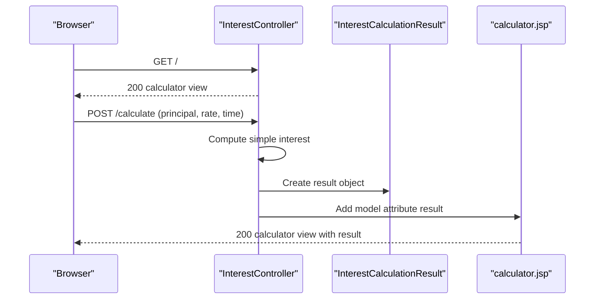

# API & Service Communication Contracts

This application exposes a small server-rendered web API surface with synchronous MVC request handling and no inter-service messaging.

## Service Catalog

| Service | Port | Category | Purpose |
|---|---|---|---|
| ZavaInterestCalculator | 8080 (default Spring Boot) | API Layer | Serves calculator page and computes interest result |

## API Endpoints Inventory

| Service | Method | Path | Request Type | Response Type |
|---|---|---|---|---|
| ZavaInterestCalculator | GET | / | None | View name `calculator` (HTTP 200) |
| ZavaInterestCalculator | POST | /calculate | Form params: principal, rate, time (double) | View name `calculator` with `InterestCalculationResult` model (HTTP 200) |

## Management & Observability Endpoints

| Service | Endpoint | Custom Metrics (if any) |
|---|---|---|
| ZavaInterestCalculator | None explicitly configured | None detected |

## DTOs & Contracts

The API contract is form-driven. `InterestCalculationResult` is a response model object populated by the controller and exposed to JSP rendering. No gateway-level DTOs, OpenAPI schemas, protobuf contracts, or custom serialization modules were identified.

## Communication Patterns

Request handling is synchronous: browser requests hit `InterestController`, calculation is done in-process, and the same JSP view is rendered with model data. No asynchronous messaging, retries, circuit breakers, service discovery, or downstream API calls were found. No explicit API authentication, authorization rules, or TLS configuration were detected at the application level.

## Service Technology Matrix

| Service | Web | Data Access | Discovery | Gateway | Actuator | Cache | Metrics |
|---|---|---|---|---|---|---|---|
| ZavaInterestCalculator | Spring MVC + JSP | Spring Data JPA configured | None | None | None detected | None detected | None detected |

## Service Communication Sequence

