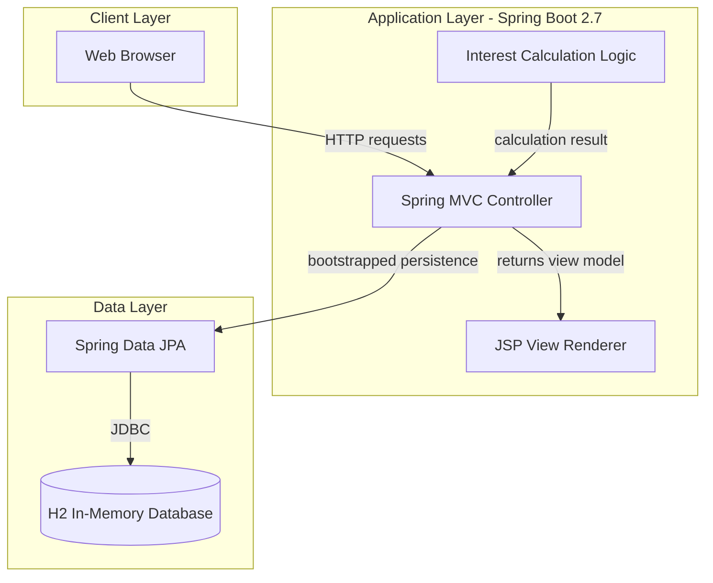
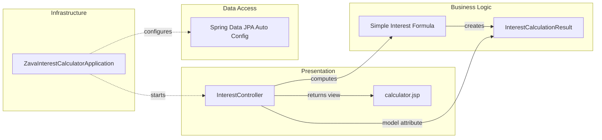

# Architecture Diagram

This document summarizes the high-level application architecture and component relationships for ZavaInterestCalculator.

## Application Architecture

### Technology Stack Summary

| Layer | Technology | Version | Purpose |
|---|---|---|---|
| Presentation | JSP | Servlet/JSP | Render calculator form and result |
| Application | Spring Boot Web | 2.7.2 | Handle web routing and MVC flow |
| Business | Java service logic | Java 8 | Compute simple interest |
| Data | Spring Data JPA + H2 | Boot-managed | In-memory datasource configuration |

### Data Storage & External Services

The application is configured with an in-memory H2 database through Spring datasource settings. No external APIs, queues, or third-party runtime service integrations were identified.

### Key Architectural Decisions

- Uses server-side MVC with JSP views rather than a separate frontend SPA.
- Keeps business logic lightweight in the controller flow for a single use-case calculator.
- Uses embedded in-memory data source configuration, minimizing operational dependencies.

## Component Relationships

### Component Inventory

| Component | Layer | Type | Responsibility |
|---|---|---|---|
| ZavaInterestCalculatorApplication | Infrastructure | Spring Boot App | Bootstraps runtime |
| InterestController | Presentation | MVC Controller | Serves form and handles calculation post |
| calculator.jsp | Presentation | JSP View | Displays form and computed result |
| InterestCalculationResult | Business Logic | DTO/Model | Carries calculated values to the view |
| Spring Data JPA Auto Config | Data Access | Framework Component | Provides JPA/data source wiring |
