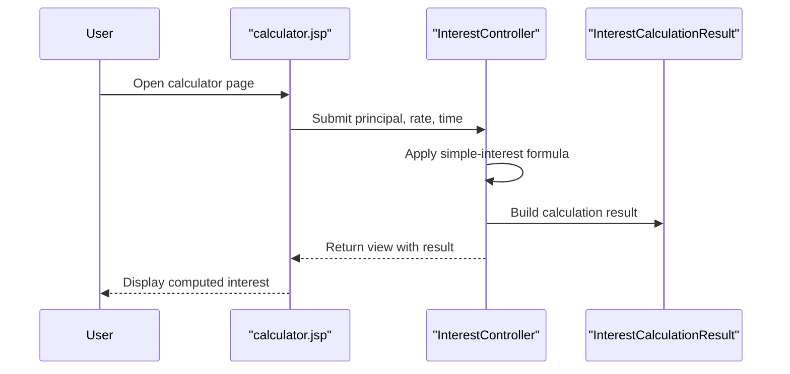

# Core Business Workflows

The application supports a focused business workflow: collecting user financial inputs and returning a computed simple-interest result.

## Domain Entities

| Entity | Service / Bounded Context | Description | Key Relationships |
|---|---|---|---|
| InterestCalculationResult | Calculation context | Represents computed output for a single request | Produced by controller and rendered by view |
| Interest Input (principal, rate, time) | Calculation context | User-submitted data for interest computation | Inputs transformed into output result |

## Service-to-Domain Mapping

| Service | Domain Context | Owned Entities | External Dependencies |
|---|---|---|---|
| ZavaInterestCalculator | Interest Calculation | InterestCalculationResult, request inputs | None |

## Primary Workflows

### Workflow 1: Calculate Simple Interest

A user opens the calculator page, enters principal/rate/time, submits the form, and receives a computed interest value on the same page.

Steps:
1. User loads calculator UI.
2. User submits form with numeric values.
3. Controller computes `(principal * rate * time) / 100`.
4. Result model is attached to response view.
5. UI shows the computed amount.

## Cross-Service Data Flows

No cross-service composition or aggregation flows were identified. All processing occurs in one application boundary with no downstream service calls.

## Business Workflow Sequence

## Business Rules & Decision Logic

- Primary computation rule: simple interest equals `(principal * rate * time) / 100`.
- Required-input rule: form requires principal, rate, and time values before submission.
- Processing is synchronous and deterministic, with no multi-step approval, state transitions, or compensating transactions.
