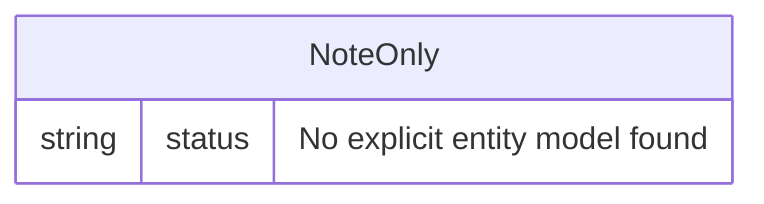

# Data Architecture & Persistence Layer

This project has a very light persistence footprint with datasource and JPA configuration present, but no explicit domain entity/repository implementation in source code.

## Database Configuration

| Service/Module | DB Type | Profile | Driver | Connection | Migration Tool |
|---|---|---|---|---|---|
| ZavaInterestCalculator | H2 (in-memory) | default | org.h2.Driver | jdbc:h2:mem:testdb | None detected |

## Data Ownership per Service

| Service | Tables Owned | ORM Framework | Caching | Notes |
|---|---|---|---|---|
| ZavaInterestCalculator | None explicitly modeled | Spring Data JPA configured | None detected | No `@Entity` or repository interfaces found |

## Entity Model

## Key Repository Methods

| Service | Repository | Notable Methods | Purpose |
|---|---|---|---|
| ZavaInterestCalculator | None detected | None | No custom data access methods found |

## Caching Strategy

No cache provider, cache regions, or cache annotations were detected. The application performs direct in-process calculation and renders the response immediately.

## Data Ownership Boundaries

The application appears to be a single-service monolith with no cross-service data boundaries. There is no evidence of shared database access between services or CQRS-style read/write separation.

### Data Classification & Sensitivity

| Entity | Sensitive Fields | Classification (PII/PHI/PCI/None) | Controls in Place |
|---|---|---|---|
| InterestCalculationResult (transient model) | principal, rate, time values submitted by user | None | No persistent storage model detected |
