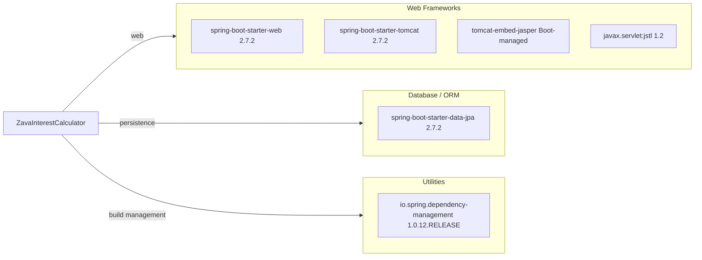

# Dependency Map

This document summarizes the declared dependencies for ZavaInterestCalculator and groups them by functional role.

## Dependencies

### Dependency Summary

| Category | Count | Key Libraries | Notes |
|---|---:|---|---|
| Web Frameworks | 4 | spring-boot-starter-web, spring-boot-starter-tomcat | Traditional servlet/JSP stack |
| Database / ORM | 1 | spring-boot-starter-data-jpa | JPA support is declared though domain is minimal |
| Utilities | 1 | io.spring.dependency-management plugin | Centralized version management |

### Version & Compatibility Risks

Spring Boot 2.7.x is stable but older than current major lines, so modernization efforts may eventually require framework and Java runtime upgrades. JSP/Tomcat embedded rendering can also limit portability versus newer template/front-end patterns.

### Notable Observations

- Dependency set is small and focused on Spring MVC + JSP rendering.
- JPA is declared even though there are no explicit repository/entity classes in source.
- No dedicated security, messaging, caching, or observability dependencies are declared.

## Test Dependencies

| Framework | Version | Notes |
|---|---|---|
| spring-boot-starter-test | Boot-managed (2.7.2 line) | Aggregates JUnit and Spring test support |

Total test-scope dependencies: 1

Test infrastructure is minimal and only includes the default Spring Boot testing bundle.
